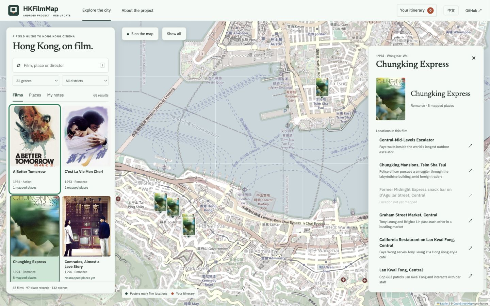

#  HKFilmMap

### 沿着电影，走进香港。

这是为 **香港理工大学 LSGI541（2025/26 第二学期）开发的 Android 课程项目**。现在基于原有数据，新增适合电脑浏览的 **Web 电影地图**。

**[打开 Web 地图 ↗](https://fwrog.github.io/HKFilmMap/?lang=zh)** · [English](README.md) · [项目介绍](https://fwrog.github.io/HKFilmMap/project.html?lang=zh) · [课程报告 PDF](web/report/HKFilmMap_Project_Report_Public.pdf)

## Android 原版演示

[](docs/media/demo.mp4)

[完整视频](docs/media/demo.mp4) · [Android 架构与算法](docs/PROJECT_DESCRIPTION.md)

## Web 更新

[](https://fwrog.github.io/HKFilmMap/?lang=zh)

> 课程本身的开发成果是 **Android App**。Web 是后续新增的可视化更新，具有独立的界面与功能范围；课程报告介绍的是原 Android 项目。

## 在浏览器里可以做什么

- **查找**：中英文搜索电影、导演与地点，按类型、地区筛选。
- **探索**：点电影聚焦取景地，点海报标记或地点阅读对应场景。
- **规划**：添加、删除与调整行程站点，优化顺序，在 Google Maps 打开步行路线。
- **记录**：新建、编辑、搜索、删除个人地点笔记，撤销删除，导出或导入 JSON 备份。

Web 不需要登录或 API 密钥。个人笔记与行程保存在当前浏览器；清除浏览器存储会移除这些内容，笔记可提前导出。底图需要联网加载。

| 数据 | 数量 |
| :--- | ---: |
| 电影 | 68 |
| 地点记录 | 97 |
| 场景记录 | 142 |
| 可上图场景 / 对应地点 | 85 / 57 |

统计来自项目打包的 SQLite 数据库。尚未定位的场景仍可在电影详情中查看。这是课程目录的规模，不代表每条电影与地点关联均已独立核验。

## Android 原版与 Web 更新

| | Android 课程项目 | Web 更新 |
| :--- | :--- | :--- |
| 地图 | Google Maps、电影和场景详情 | Leaflet、海报标记、搜索与中英切换 |
| 行程 | 编辑、自动半日行程生成与优化 | 最多 8 站、手动编辑、两条入门路线、精确顺序优化 |
| 个人内容 | 账号、场景打卡与成就 | 浏览器本地笔记，可导入导出 |
| 美食 | 34 条附近推荐记录 | 未包含 |
| 导航 | Google Directions API | 跳转 Google Maps 步行导航 |

Web 固定首站并优化站间直线总距离。地图虚线只表示顺序，**不是可通行道路或步行时间**；到访前需要确认场所现状。

## 本地运行与部署

```sh
python3 -m http.server 4021 --directory web
# 浏览器打开 http://localhost:4021
```

更新 Android 种子数据库后重新导出并检查：

```sh
python3 web/export_data.py
node --test web/tests/model.test.mjs
```

Web 无需构建步骤，通过 [GitHub Pages 工作流](.github/workflows/pages.yml) 自动部署。仅导出电影、地点、场景表，不发布 Android 用户打卡与行程数据。

Android 运行请查看[配置指南](docs/CONFIGURATION.md)，提供本地 Google Maps 与 Firebase 配置，然后在 Android Studio 打开 `HKFilmMap/`。数据处理见 [backend/README.md](backend/README.md)。

## 报告与成员

[**HKFilmMap: Exploring Hong Kong film locations through an interactive map**](web/report/HKFilmMap_Project_Report_Public.pdf) — 21 页英文报告。公开副本保留作者信息与原报告内容，去除了学号和含账号信息的截图。

- **Yikai Wu**：代码、算法、数据库与报告统筹。
- **Yu Cai**：地图探索、电影目录、详情交互与展示材料。
- **Anran Chen**：演示文稿设计与报告材料。
- **Junkai Meng**：演示视频与项目展示。

分工依据报告中的个人贡献说明。当前 Web 验证不代表重新完成 Android 构建或真机验收。

## 设计与许可

[设计说明](docs/design/city-frames.md)记录地图优先的界面方向。交互参考 [Anitabi](https://www.anitabi.cn/map)，结合本项目的电影、场景与地点关系重新实现。

原创代码和文档采用 [MIT](LICENSE)。海报、电影元数据等第三方内容遵循原权利与条款，见[第三方声明](THIRD_PARTY_NOTICES.md)。地图由 OpenStreetMap 数据和 Leaflet 提供。
